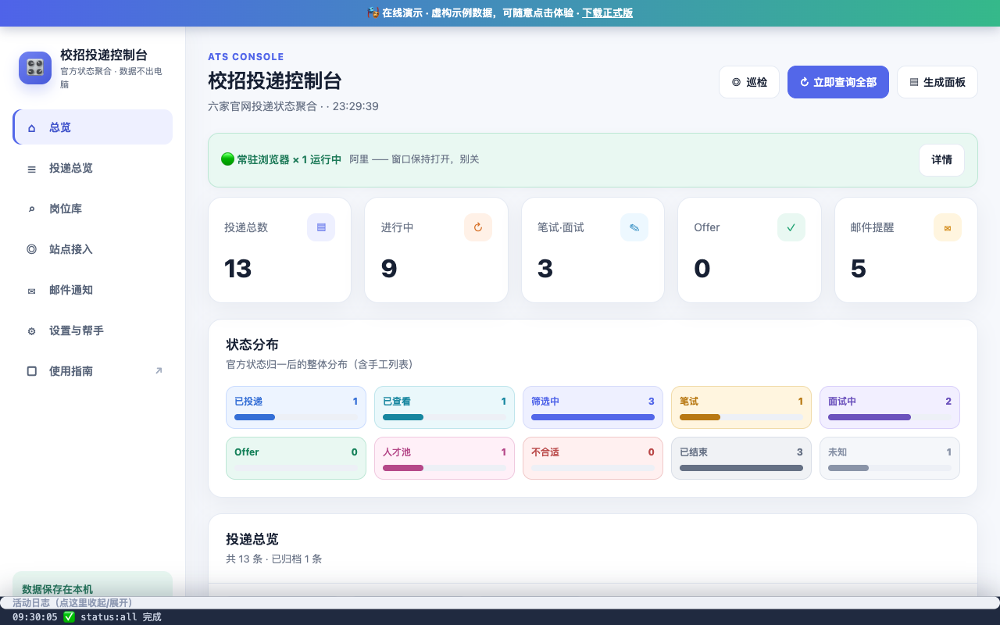

# 校招投递控制台 · campus-apply-tracker

把字节 / 阿里 / 美团 / 携程 / 小红书 / 快手各家招聘官网里**你自己的投递状态**聚合成一张表,笔试/面试邀约邮件自动提取时间地点,状态一变就提醒。

> **数据不出本机**:登录会话、投递记录、邮箱授权码全部只存在你自己的电脑上(`~/.ats-status/`),没有服务器、没有云端、不上报任何东西。



## 它是什么

- 一个跑在你电脑上的本地控制台(浏览器打开 `http://127.0.0.1:7788`,只绑定本机);
- **岗位库**:两种岗位源——普通用户**开箱即用**:点「同步岗位库」自动从公开仓库拉最新岗位包(更新尽力而为,通常每工作日 12:00 / 21:30 各一次;离线或仓库不可达时回落安装包内置版本);维护者额外可绑定自己的**腾讯智能表格**(地址存 `~/.ats-status/jobs.json`,文档保持「有链接即可查看」)。浏览、搜索、截止提醒、「已投/不投/关注」本地标记(重同步不丢),官网已有投递的岗位会提示「可能已投」一键确认;

维护者更新岗位包(对外只发数据快照,智能表格地址永不分发;默认剥离内推码/联系人并清洗链接里的内推参数,`--full` 保留全部):

```bash
ats jobs sync      # 从自己的智能表格拉最新岗位(维护者机器)
ats jobs pack      # 导出 jobs-pack.json → 提交仓库并 push,用户点同步即拿最新
ats jobs publish   # 一键流水线:同步→防呆检查→打包→git 提交推送
```

也可在控制台「设置 → 定时任务」安装**岗位包定时发布**(每日 12:00 / 21:30 自动执行上述流水线):定时器只 curl 本地控制台 API,发布走 runJob 守卫不会与查询抢浏览器;岗位数低于绝对下限、或比上一版骤降过半时自动拦截不发并弹系统通知,防止文档被误清空时把坏包发布出去;推送失败也已提交本地,通知里会提示手动补推。

普通用户拿最新岗位数据不需要重装:岗位包默认走公开仓库的 raw 直链(一次匿名 GET,只下载公开文件,不上报任何用户数据);离线时自动用安装包内置的包。
- **人工登录一次**(扫码/短信必须人做),之后程序低频复用会话查询,你只看结果;
- 各家状态接口是私有的,内置**抓包向导**自动识别,不为每家硬编码逆向;
- 目前**预置 6 家**(字节/阿里/美团/携程/小红书/快手),**持续扩展中**——任何有官网「我的投递」页的公司都能用抓包向导自行接入,欢迎提 issue 贡献新站点;其余公司走手工登记(`apps.json` 或网页导入),一样进总览。

配套的纯网页版投递台账(不装任何后台)在 [campus-recruitment-tracker](https://github.com/tian-zhen-yin/campus-recruitment-tracker);本控制台可把官方状态同步给台账(`tracker-sync`),两者可单独使用。

## 快速开始

**方式 A(推荐,无需命令行)**:到 [Releases](../../releases) 下载对应系统的完整版压缩包(macOS / Windows),解压后双击安装:
- macOS:双击「安装.command」;首次被 Gatekeeper 拦截属正常,见包内《必读-安装说明》;
- Windows:解压后右键「以 PowerShell 运行」`install.ps1`。

**方式 B(源码,需要 Node.js ≥ 18)**:

```bash
git clone https://github.com/tian-zhen-yin/campus-apply-tracker.git
cd campus-apply-tracker && npm i
npm run ui          # 打开 http://127.0.0.1:7788
```

### 首次配置:每家站点两步(以快手为例)

1. 控制台点「常驻登录」→ 在弹出的浏览器里扫码/验证码登录 → 回控制台点「登录完成」;
2. 点「抓包」→ 在浏览器里打开「我的投递」页 → 回控制台按回车,自动识别状态接口。

之后随时「查状态」;装上定时任务(控制台内一键安装)则每天 09:30 / 14:30 / 20:00 自动查询,状态变化弹系统通知。小红书/快手有预置接口(2026-09 实测),登录后可能免抓包直接查。

### 邮件监控(邀约不漏)

控制台配置邮箱授权码(163 / QQ / Gmail,IMAP 官方授权),笔试/面试邮件自动提取**轮次、时间、地点**,挂到对应投递记录上;支持多邮箱。

## 工作原理与频率

| 环节 | 做法 |
|---|---|
| login / 常驻登录 | 人工登录一次,会话存本地持久 profile |
| capture | 录制「我的投递」页 XHR,打分选出状态接口并当场验证 |
| status | 无头查询:API 直连,签名/风控接口自动降级为整页访问截获 |
| keepalive | 默认 **12 小时一次 ±40% 抖动,夜间(08:00–23:30 之外)零流量**;掉线不加密试探,提示重登 |
| 邮件 | IMAP 拉取近 45 天,发件域名 + 主题识别招聘相关,邀约正文提取安排 |

## ⚠️ 使用红线(请务必读完再装)

- **个人自用**:默认 12 小时低频 + 随机抖动是有意设计的,请不要改小间隔、不要批量采集、不要二次分发或商业化——工具越激进,招聘站风控越紧,最终所有人的接口一起失效;
- 招聘站点随时可能改版或升级风控,届时需要重新抓包,本工具不承诺持续可用;
- 本项目与上述公司无任何关联;请遵守各站点服务条款,账号风险自负;
- 支持平台:macOS、Windows(打包版);源码路线理论上任何能跑 Node + Chrome 的桌面系统。

## 数据与卸载

所有数据(登录会话、抓包的接口、投递记录、邮箱授权码、人工修正、岗位库 `jobs.json` 及其腾讯文档登录会话)都在 `~/.ats-status/` 一个目录里;卸载 = 删目录 + 移除控制台里的定时任务。(目录名沿用历史标识 `ats-status`,见 [ADR-0005](docs/adr/0005-public-repo-vs-internal-identifiers.md)。)

## 开发者

```bash
npm test            # 单元测试(合并逻辑/身份键/修正覆盖层/邮件关联)
npm run cli         # 终端入口,全部能力同控制台
```

- 领域词汇表:[CONTEXT.md](CONTEXT.md);决策记录:[docs/adr/](docs/adr/);
- 完整图文教程:[docs/guide.html](docs/guide.html)(控制台内「使用指南」直达);
- 预置接口策略与红线依据:[ADR-0004](docs/adr/0004-opensource-presets-and-redline.md)。

## License

[MIT](LICENSE) © 2026 The campus-apply-tracker Authors
